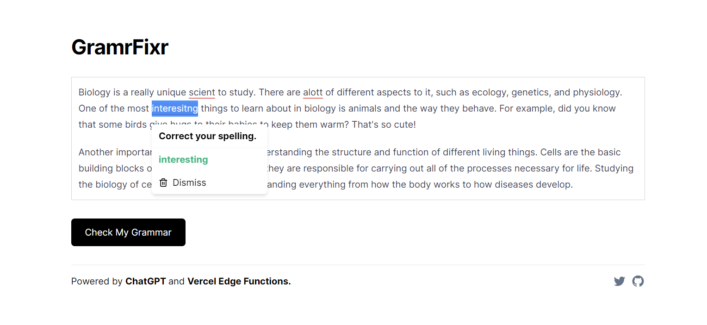

# [GramrFixr.com](http://gramrfixr.com)

This project fixes your grammar using OpenAI GPT-3. 

[](https://www.gramrfixr.com/)

## How it works 

The project uses the [OpenAI GPT-3 API](https://openai.com/blog/openai-api/) to fix your grammar.

## Running Locally 

After cloning the repo, go to [OpenAI](https://beta.openai.com/) and create an account and put your API key in an .env file. You can create one by renaming .env.example to .env and putting your API key in there. 

Then, run the development server first install the packages:

```bash
    npm install 
``` 

and then run the development server:

```bash
    npm run dev
```
